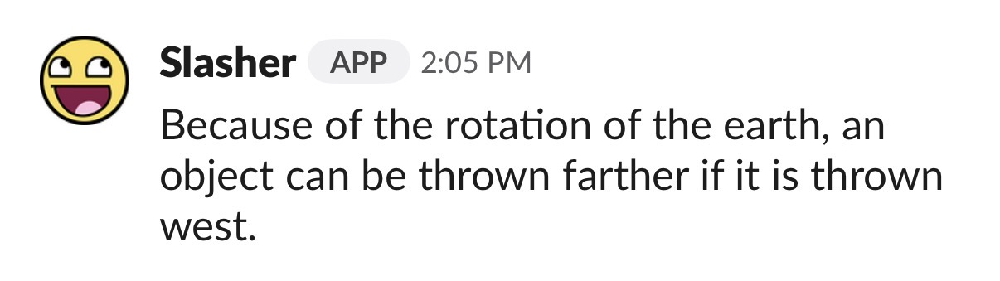
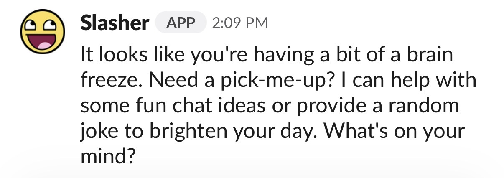

# Hi, I am...

## Commands
- **/slasher-help** - Show a list of all commands
- **/slasher-hello** - Greeting from Slasher
- **/slasher-ping** - Check bot latency
- **/slasher-trivia** - Get random trivia about the world
- **/slasher-ask** - Ask Slasher anything

## /slasher-trivia?
Slasher fetches random useless facts about the world using [this free API](https://uselessfacts.jsph.pl/api/v2/facts/random?language=en), and then uses `data.text` to display them to you, which takes less than 2 seconds 🚀

## /slasher-ask?
Slasher sends your prompt to [his Cloudflare Worker AI clone](https://slasher.kelviny.workers.dev), and then throws his clone's response back to you.

(AI response usually takes 10-15 seconds, idk why that long :/)

